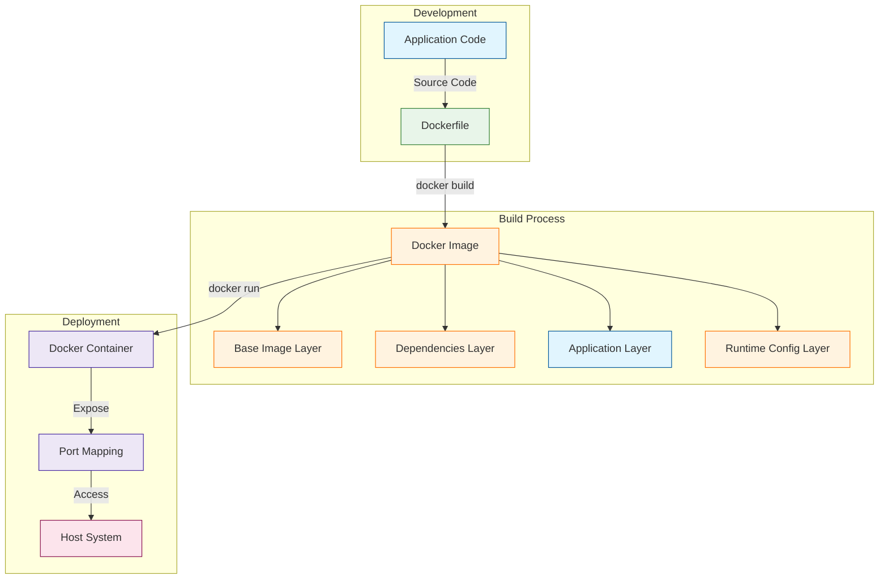
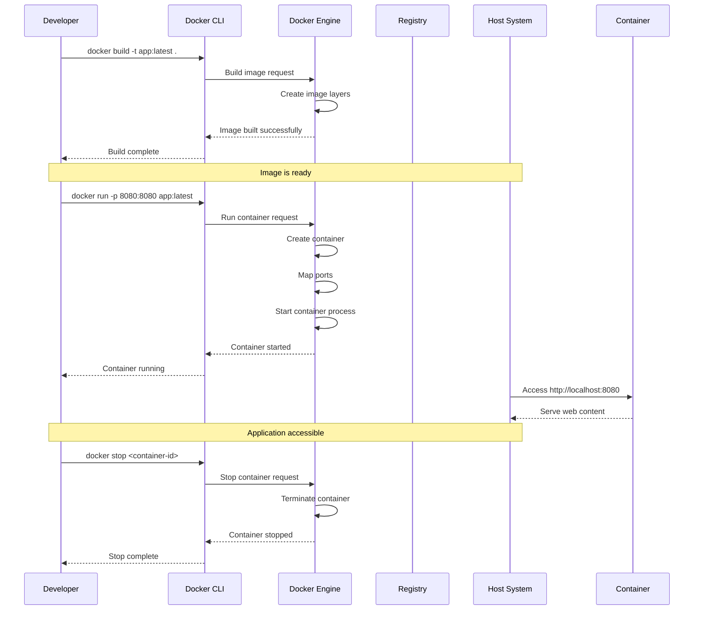

# Part 1 - Deploying an Application using Docker

## Script Overview

### Docker Containerization Workflow


### Build and Run Process


### Summary
**Docker: Containerization for Modern Application Deployment**

This tutorial provides a hands-on introduction to Docker, the industry-standard containerization platform that revolutionizes how we build, ship, and run applications.

**What We'll Build:**
- A containerized Go web application that can run consistently across any environment
- A well-structured Docker image with optimized layers
- A running container with proper port mappings for web access
- A solid foundation for further containerization practices

**Core Docker Concepts Covered:**
1. **Dockerfile**: The blueprint that defines how to package our application
2. **Docker Images**: Immutable packages containing everything needed to run an application
3. **Docker Containers**: Isolated, lightweight runtime environments for our application
4. **Layer Caching**: The performance optimization that speeds up builds
5. **Port Mapping**: The networking configuration that exposes our application

**Why Docker Matters:**
- **Consistency**: Eliminates "works on my machine" problems
- **Isolation**: Prevents dependency conflicts between applications
- **Efficiency**: Uses fewer resources than traditional virtual machines
- **Portability**: Runs the same across development, testing, and production
- **Scalability**: Forms the foundation for orchestration with Kubernetes

**Development Benefits:**
- Faster onboarding for new developers
- Simplified local development environments
- Identical environments across all stages of deployment
- Easier integration testing with containerized dependencies
- Reduced debugging time for environment-related issues

By completing this tutorial, you'll understand the fundamentals of Docker and be equipped to containerize your own applications, setting the stage for more advanced container orchestration with Kubernetes in upcoming parts.

## Pre-Recording Setup Instructions

### Technical Setup
1. **Install Docker** - Ensure Docker is properly installed and running on your system
2. **Go Installation** - Verify Go is installed (version 1.21.6 as per go.mod)
3. **Terminal Setup** - Use a clean terminal with increased font size (16-20pt) for better visibility
4. **Browser** - Have a web browser ready for viewing the local web server
5. **Text Editor/IDE** - Have VS Code or your preferred editor ready with the project files open
6. **GDG Branding** - Have GDG HKUST logo and branding elements ready for overlays
7. **Demo Checkpoints** - Test all commands beforehand to ensure smooth demonstration

### Recording Environment
1. **Clean Desktop** - Remove personal files, notifications, and set a neutral background
2. **Privacy Check** - Close any sensitive information, emails, or personal apps
3. **Screen Resolution** - Set to 1920x1080 for optimal viewing
4. **Microphone Test** - Check audio quality before starting
5. **Camera Position** - If showing yourself, ensure good lighting and a professional background
6. **Do Not Disturb** - Enable Do Not Disturb mode to avoid notifications
7. **GDG Attire** - Consider wearing GDG t-shirt or having GDG visual elements in frame
8. **Rehearse Once** - Run through the commands once before recording to ensure everything works

## Interactive Script for Docker Introduction

### [SCENE 1: Introduction] - 30 seconds
*[Start with terminal window and editor side by side, GDG HKUST logo in corner]*

**YOU:** "Hey everyone! 👋 Welcome to this Google Developer Group HKUST tutorial on Docker and Kubernetes! [*gesture: open arms welcome*] I'm excited to show you how Docker is revolutionizing the way we build, ship, and run applications. 

I'm Andy, a core tech team member of GDG HKUST, and i will be your guide in this tutorial.

Instead of a theoretical lecture, we'll learn by doing! 💻 In just a few minutes, we'll containerize this simple Go web server step by step. Ready? Let's dive in!" [*gesture: brings hands together showing focus*]

### [SCENE 2: The Application] - 1 minute
*[Focus on the code editor with main.go open, use visual pointer to highlight code]*

**YOU:** "First, let's understand what we're working with. 🔍 This is a super simple Go web server that serves a static HTML page." [*gesture: frames the code with hands*]

*[Highlight the key parts of the main.go file with animated highlights or cursor movements]*

**YOU:** "It creates a file server pointing to our static folder, listens on port 8080, and that's it! Let's run it the traditional way first." [*gesture: typing motion*]

*[Run the command in terminal with enlarged font]*
```
go run main.go
```

**YOU:** "Great! Our server is up and running! 🚀 Let's check it out in the browser." [*gesture: pointing from terminal to browser*]

*[Switch to browser and navigate to http://localhost:8080 with smooth transition]*

**YOU:** "Nice! But what if we want to share this with someone else? 🤔 What if they don't have Go installed? That's where Docker comes in!" [*gesture: questioning pose then confident resolution*]

### [SCENE 3: Enter Docker] - 1 minute
*[Split screen between browser and terminal with GDG visual transition]*

**YOU:** "Docker lets us package everything our app needs into a single container - think of it as a lightweight, portable environment. 📦" [*gesture: hands forming a box shape*]

*[Switch to editor and open the Dockerfile with visual transition]*

**YOU:** "This is a Dockerfile - the blueprint for our container. 📝 Let's break it down line by line." [*gesture: stepping motion with fingers*]

### [SCENE 4: Dockerfile Walkthrough] - 2 minutes
*[Focus on the Dockerfile in editor with animated highlights]*

**YOU:** "First, we start with a base image. ⚓ This `FROM` line says we want to use the official Go image version 1.21.6 as our foundation." [*gesture: foundation building motion*]

*[Highlight the FROM line with visual effect]*

**YOU:** "Then we set up our working directory inside the container with `WORKDIR`. 🏠 This is where our code will live." [*gesture: creating space with hands*]

*[Highlight the WORKDIR line]*

**YOU:** "Next, we copy our code from our machine into the container with `COPY . .` - that's copying everything from our current directory to the container's working directory." [*gesture: grabbing and placing motion*]

*[Highlight the COPY line]*

**YOU:** "Here's where the magic happens ✨ - `RUN` executes a command inside the container. We're building our Go application with static linking for better portability." [*gesture: magic wand motion*]

*[Highlight the RUN line]*

**YOU:** "We tell Docker that our app will use port 8080 with the `EXPOSE` instruction. 🔌" [*gesture: opening a door*]

*[Highlight the EXPOSE line]*

**YOU:** "Finally, `CMD` defines what command runs when the container starts. In our case, it's running our compiled server. 🏁" [*gesture: start motion*]

*[Highlight the CMD line]*

**YOU:** "And that's it! Just a few lines that tell Docker exactly how to package and run our application. Isn't that elegant? 👌 Now let's build this image." [*gesture: brings fingertips together to show precision*]

### [SCENE 5: Building the Image] - 1 minute
*[Focus on terminal with GDG-styled command prompt]*

**YOU:** "To build our Docker image, we use the `docker build` command. The `-t` flag lets us give our image a name or tag. 🏷️" [*gesture: labeling motion*]

*[Run the command with visual highlighting]*
```
docker build -t docker-k8s-part1 .
```

*[As it builds, explain what's happening with animated visuals showing the layering process]*

**YOU:** "Look at Docker working its magic! 🧙‍♂️ It's following each step in our Dockerfile - pulling the base image, copying our files, building our application... Each step creates a layer in our final image, and Docker caches these layers to speed up future builds." [*gesture: stacking motion*]

*[When build completes with success message highlighted]*

**YOU:** "Awesome! Our image is built. 🎉 Let's verify it exists." [*gesture: checkmark motion*]

*[Run the command]*
```
docker images
```

**YOU:** "There it is! Now we're ready to run our containerized application. Exciting, right? 😃" [*gesture: thumbs up*]

### [SCENE 6: Running the Container] - 1 minute
*[Terminal view with GDG visual elements]*

**YOU:** "Now for the fun part - let's run our container with `docker run`. We'll use `-p` to map port 8080 from the container to our local machine. 🔄" [*gesture: connecting two points*]

*[Run the command]*
```
docker run -p 8080:8080 docker-k8s-part1:latest
```

**YOU:** "Our container is running! Let's check the browser again." [*gesture: pointing to browser*]

*[Switch to browser, refresh the page with animated transition]*

**YOU:** "Amazing! 🤩 Same app, but now it's running inside a container! The beauty is that this will run exactly the same way on any machine with Docker installed - no need to worry about dependencies or configuration. It just works!" [*gesture: chef's kiss*]

### [SCENE 7: Managing Containers] - 1.5 minutes
*[Open a new terminal window with GDG-styled split screen]*

**YOU:** "While our container is running, let's explore some handy container management commands. These are essential tools in your Docker toolkit! 🧰" [*gesture: tool selection*]

*[Run command with animated typing]*
```
docker ps
```

**YOU:** "This shows our running containers. We can see our container ID, the image it's based on, when it was created, and what ports are mapped. Super useful for monitoring! 📊" [*gesture: scanning the list*]

*[Run command]*
```
docker stop $(docker ps -q)
```

**YOU:** "We just stopped our container. Let's verify it's stopped." [*gesture: stop sign*]

*[Run command]*
```
docker ps
```

**YOU:** "Empty list! Now let's see all containers, including stopped ones. 👀" [*gesture: wide view motion*]

*[Run command]*
```
docker ps -a
```

**YOU:** "There's our stopped container. We can restart it, or remove it if we're done with it." [*gesture: pointing*]

*[Run command]*
```
docker rm $(docker ps -a -q)
```

**YOU:** "Container removed! But our image is still there, so we can always create a new container from it. That's the power of Docker! 💪" [*gesture: muscle flex*]

### [SCENE 8: Additional Docker Commands] - 1 minute
*[Terminal view with command cheatsheet visual aid]*

**YOU:** "Let's explore a few more useful Docker commands that GDG developers use daily." [*gesture: counting on fingers*]

*[Run command with highlight effect]*
```
docker run -d -p 8080:8080 --name my-web-app docker-k8s-part1:latest
```

**YOU:** "The `-d` flag runs the container in detached mode (in the background), and we've given it a friendly name with `--name`. Very convenient for development workflows! 🏃‍♂️" [*gesture: pointing behind you*]

*[Run command]*
```
docker logs my-web-app
```

**YOU:** "We can check the logs of our running container. This is super helpful for debugging. 🔍" [*gesture: looking through magnifying glass*]

*[Run command]*
```
docker exec -it my-web-app /bin/bash
```

**YOU:** "And we can even jump inside a running container with `exec`. Now we're inside the container's shell! 🧪" [*gesture: diving motion*]

*[Type 'exit' in the shell with visual highlight]*

**YOU:** "Let's clean up before we wrap up." [*gesture: wiping motion*]

*[Run commands with smooth transitions]*
```
docker stop my-web-app
docker rm my-web-app
```

### [SCENE 9: Conclusion] - 30 seconds
*[Face to camera with GDG HKUST branding and Docker visualization]*

**YOU:** "And there you have it! 🎯 We've successfully containerized our Go web server using Docker. Now our application can run consistently across any environment that has Docker installed." [*gesture: wide arms showing accomplishment*]

**YOU:** "This is just the beginning of our Docker and Kubernetes journey! In the next GDG HKUST tutorial, we'll explore how to manage multiple containers with Docker Compose. 🚀" [*gesture: forward pointing motion*]

**YOU:** "If you found this helpful, hit that like button and subscribe to the GDG HKUST channel for more tech tutorials. Thanks for watching, and happy containerizing! 👋" [*gesture: wave goodbye*]

## Motion Instructions and Timing

- **Total Video Length**: Aim for 7-8 minutes (concise and impactful)
- **Pace**: Energetic but clear, maintain GDG professional enthusiasm
- **Motion Flow**: 
  - Use smooth GDG-branded transitions between scenes
  - Highlight code with animated overlays
  - Display command results with visual emphasis
  - Use split-screen to show cause-effect relationships
  - Keep cursor movements deliberate and purposeful
  
- **Visual Aids**:
  - GDG HKUST logo in corner throughout
  - Docker concept animations for container/image explanations
  - Command cheatsheet overlay during terminal sections
  - Success/completion animations at key milestones
  - Subtitles for key technical terms

- **Engagement Tips**:
  - Maintain high energy appropriate for GDG presentations
  - Use emojis on screen to reinforce emotional points
  - Ask rhetorical questions to keep viewers thinking
  - Show genuine excitement at successful outcomes
  - Reference the GDG community and Docker's importance to developers 