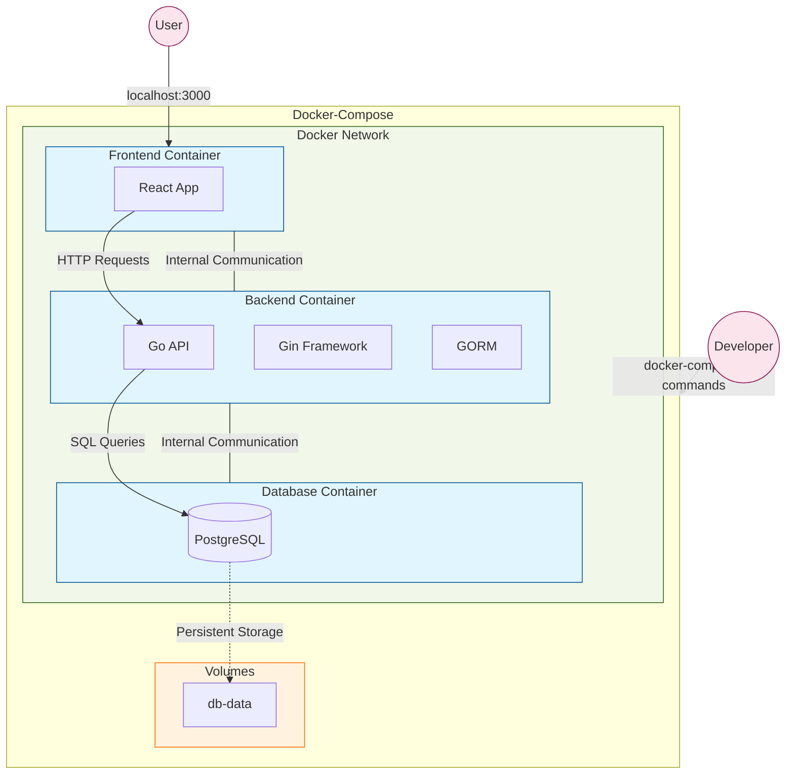
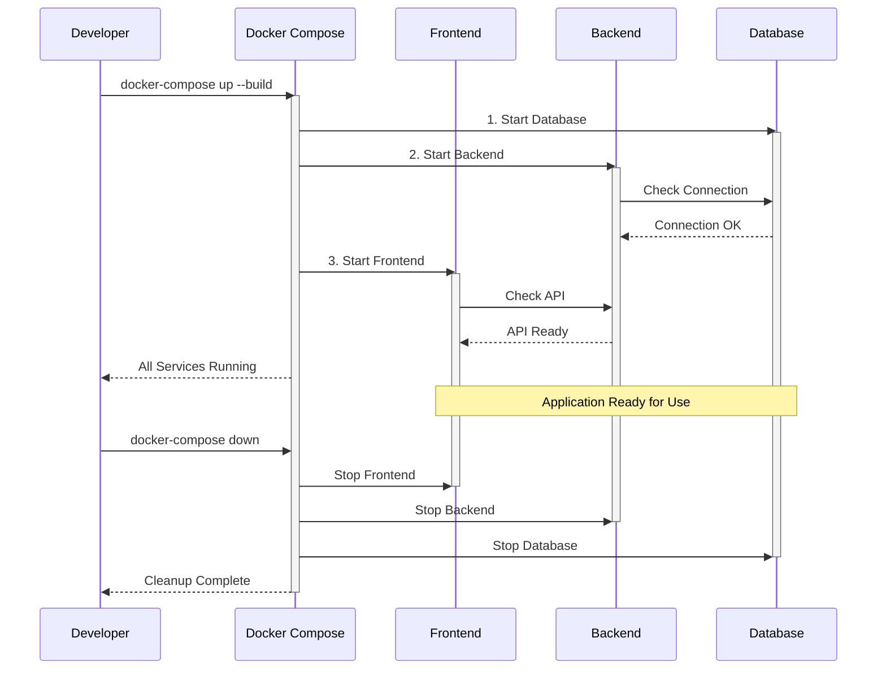

# Docker Compose: Part 2 - Interactive Script for GDG HKUST

## Script Overview

### Application Architecture


### Workflow Steps


### Summary
This tutorial demonstrates how to use Docker Compose to orchestrate a multi-container application, specifically a todo application with React frontend, Go backend, and PostgreSQL database. The session walks through the entire process from understanding the project structure to deploying and managing the application using Docker Compose.

### Duration
- **Total Time**: 8-10 minutes
- **Setup Time**: 15-20 minutes (pre-recording)
- **Scene Breakdown**:
  - Introduction: 30 seconds
  - Project Structure: 1 minute
  - Docker Compose File: 2 minutes
  - Application Deployment: 1 minute
  - Exploration & Demo: 2 minutes
  - Cleanup: 1 minute
  - Advanced Features: 2 minutes
  - Production Tips: 30 seconds

### Key Focus Areas
1. **Multi-Container Architecture**
   - Understanding service relationships
   - Container communication
   - Data persistence

2. **Docker Compose Fundamentals**
   - YAML configuration
   - Service definitions
   - Network & volume management

3. **Practical Development**
   - Local development workflow
   - Debugging techniques
   - Common commands & tools

4. **Best Practices**
   - Production considerations
   - Security aspects
   - Resource management

### Learning Objectives
By the end of this tutorial, viewers will understand:
- How to define multi-container applications using Docker Compose
- The relationship between different services in a containerized application
- Basic to advanced Docker Compose commands and features
- Best practices for container orchestration

## Pre-Recording Setup Instructions

[*VISUAL: Start with GDG HKUST logo animation fading into setup checklist*]

### Technical Setup
1. **Docker & Docker Compose** - Ensure Docker and Docker Compose are properly installed and running
2. **Terminal Setup** - Use a clean terminal with increased font size (16-20pt) for better visibility
3. **Browser** - Have a web browser ready for viewing the application
4. **Text Editor/IDE** - Have VS Code or your preferred editor ready with the project files open
5. **GDG Branding** - Have GDG HKUST logo and branding elements ready for overlays
6. **Demo Checkpoints** - Test all commands beforehand to ensure smooth demonstration
7. **Application Preview** - Run the application once beforehand to make sure everything works

### Recording Environment
1. **Clean Desktop** - Remove personal files, notifications, and set a neutral background
2. **Privacy Check** - Close any sensitive information, emails, or personal apps
3. **Screen Resolution** - Set to 1920x1080 for optimal viewing
4. **Microphone Test** - Check audio quality before starting
5. **Do Not Disturb** - Enable Do Not Disturb mode to avoid notifications
6. **Rehearse Once** - Run through the commands once before recording to ensure everything works


## Interactive Script for Docker Compose

### [SCENE 1: Introduction] - 30 seconds
[*VISUAL: Smooth fade from GDG logo to split screen setup*]
[*TRANSITION: Use slide-in animation for terminal and editor windows*]
[*VISUAL: GDG HKUST logo should pulse briefly when mentioned*]

**YOU:** "Hey there **GDG community**! 👋 Welcome back to our **Docker** and **Kubernetes** series! [*gesture: open arms welcome*] In Part 1, we containerized a simple web server. Today, we're *leveling up*! 🚀 We'll use **Docker Compose** to orchestrate *multiple containers* working together as a single application. Let's build a complete **todo app** with *frontend*, *backend*, and *database* containers!" [*gesture: hands showing multiple components coming together*]

---

### [SCENE 2: Understanding the Project Structure] - 1 minute
[***TRANSITION**: Smooth zoom into editor window with project structure*]
[*VISUAL: Use tree-style animation to highlight each component as mentioned*]

**YOU:** "Let's first understand what we're working with. 🔍 Our application has **three main components**:" [*gesture: counting with fingers*]

[***VISUAL**: Animated cards sliding in for each component*]
[***TRANSITION**: Gentle pulse effect as each directory is highlighted*]

**YOU:** "
1. First, a React frontend that provides our user interface. 
2. Second, a Go backend API built with Gin and GORM. 
3. And third, a PostgreSQL database to store our todos. 

In the real world, modern applications are rarely single containers - they're distributed systems with multiple specialized parts!" [*gesture: hands spreading out to show distribution*]

*[Show the directory structure with emphasis]*

**YOU:** "Before Docker Compose, managing all these containers manually was tedious and error-prone. Let's see how Docker Compose simplifies everything! 💡" [*gesture: wiping forehead showing relief*]

---
### [SCENE 3: The Docker Compose File] - 2 minutes
[***TRANSITION**: Slide editor window to center with blur effect*]
[***VISUAL**: Open docker-compose.yml with typing animation*]

**YOU:** "Here's the star of today's show - the **docker-compose.yml** file! 🌟 This single file defines our entire application architecture." [*gesture: presenting with both hands*]

[***VISUAL**: Highlight services section with glowing border*]
[***TRANSITION**: Use smooth scrolling when moving between file sections*]

**YOU:** "Docker Compose uses a YAML format where we define 'services' - these are our containers. 

Notice we have three: **frontend, backend, and db**. For each service, we define exactly how it should be built and configured." [*gesture: point to each service*]

*[Highlight the **frontend** section]*

**Frontend:** 
1. For the frontend, we're building from the Dockerfile in the frontend directory. 
2. We map port 3000 on our host to port 3000 in the container. 
3. The 'depends_on' field tells Docker Compose that this service needs the backend to be running first. [*gesture: showing dependency relationship*]

*[Highlight the **backend** section]*

**Backend:** 
1. Similarly, the backend builds from its own Dockerfile and exposes port 8080. 
2. It depends on the database service. 

Notice these environment variables - they tell our backend how to connect to the database. 

The magic of Docker Compose is that we can use service names like 'db' as hostnames! 🪄" [*gesture: magic wand motion*]

*[Highlight the **db** section]*

**Database:** 
1. For the database, we're using the official PostgreSQL image from Docker Hub. 
2. We define environment variables for configuration and use a named volume for data persistence. 
3. This ensures our data survives even if the container is removed! [*gesture: safe box motion*]

*[Highlight the networks and volumes sections]*

**YOU:** "At the bottom, we define the network that connects our containers and the volume for data persistence. Docker Compose creates this infrastructure automatically! Isn't that elegant? 👌" [*gesture: chef's kiss*]

---

### [SCENE 4: Starting the Application] - 1 minute
[***TRANSITION**: Slide terminal window in from right*]
[***VISUAL**: GDG-styled command prompt with custom font and colors*]

**YOU:** "Let's see **Docker Compose** in action! With *one command*, we'll launch our entire application stack."

[***VISUAL**: Command typing animation with highlighted syntax*]
[***TRANSITION**: Split screen showing logs and command input*]


*[Run the command with visual highlighting]*
```
docker-compose up --build
```

*[As it builds and starts, explain what's happening]*

**YOU:** "The `--build` flag ensures our images are rebuilt if anything changed. Watch how Docker Compose handles everything in the correct order - first the database, then the backend that depends on it, and finally the frontend! 🔄" [*gesture: stacking motion*]

<!-- *[Show logs scrolling]*
**YOU:** "Docker Compose aggregates all the logs in one place, color-coded by service. Looking at these logs, we can see the entire build process: first the backend image being built from the Golang base image, then the frontend from Node Alpine. Notice how it shows each step - downloading layers, copying files, running commands like 'go build' and 'pnpm install'. At the end, it creates our network, volume, and all three containers. This centralized logging is incredibly useful for debugging multi-container applications!" [*gesture: monitoring motion with hand sweeping across different sections of logs*] -->

---

### [SCENE 5: Exploring the Running Application] - 2 minutes
[*TRANSITION: Smooth pan to new terminal window*]
[*VISUAL: Keep compose logs visible with reduced opacity*]

**YOU:** "While our application is running, let's see what Docker Compose created for us." [*gesture: investigative look*]

*[Run command]*
```
docker-compose ps
```

**YOU:** "This shows all services in our composition and their status. All three containers are running! 🟢" [*gesture: thumbs up*]

[*TRANSITION: Elegant slide to browser window*]
[*VISUAL: URL bar typing animation for http://localhost:3000*]

**YOU:** "Let's check our frontend!" [*gesture: presenting the app*]

*[Interact with the Todo app - add a new todo, mark one as complete, etc.]*

**YOU:** "Our Todo application works! 🎉 But what's really happening here? When you add a todo, the frontend makes an API call to the backend, which stores it in the PostgreSQL database." [*gesture: flow motion from frontend to backend to database*]

*[Switch back to terminal]*

**YOU:** "Let's explore some Docker Compose commands that help us manage this multi-container application."

*[Run command]*
```
docker-compose logs backend
```

**YOU:** "We can view logs for a specific service. Very helpful when troubleshooting! 🔍" [*gesture: magnifying glass*]

*[Run command]*
```
docker-compose exec db psql -U postgres
```

**YOU:** "We can even execute commands inside a specific container. Here we're connecting to the PostgreSQL shell. Let's check our todos table!" [*gesture: diving in motion*]

*[Inside PostgreSQL shell]*
```
\c postgres
SELECT * FROM todos;
```

**YOU:** "Look! There are our todos stored in the database! 📊 Everything's connected and working together seamlessly." [*gesture: connected hands*]

*[Exit PostgreSQL with \q and return to terminal]*

### [SCENE 6: Stopping and Cleaning Up] - 1 minute
[*TRANSITION: Fade to terminal view with GDG visual elements*]
[*VISUAL: Command prompt with custom styling*]

**YOU:** "When we're done, we can shut everything down just as easily as we started it." [*gesture: closing motion*]

*[Open new terminal and run command]*
```
docker-compose down
```

**YOU:** "The `down` command stops and removes all the containers, networks, and default volumes created by `up`. If we want to remove the named volumes too, we'd add the `-v` flag." [*gesture: sweeping motion*]

*[Show containers stopping]*

**YOU:** "Notice how Docker Compose is handling the graceful shutdown of our entire stack! 🧹" [*gesture: dusting hands*]

### [OPTIONAL: SCENE 7: Exploring the docker-compose.yml in Depth] - 2 minutes
[*TRANSITION: Split screen effect with smooth sliding animation*]
[*VISUAL: Code highlighting follows explanation*]

**YOU:** "Let's take a deeper dive into some key Docker Compose features:" [*gesture: diving motion*]

*[Highlight networking section]*

**YOU:** "Docker Compose creates a dedicated network for our application. This allows containers to find each other by service name. The `app-network` with bridge driver gives our containers an isolated communication channel." [*gesture: connecting motion*]

*[Highlight environment variables]*

**YOU:** "Environment variables provide a clean way to configure services. In production, you'd want to use Docker secrets or environment files for sensitive information like database passwords." [*gesture: lock motion*]

*[Highlight volumes section]*

**YOU:** "Volumes are critical for stateful services like databases. Without this `db-data` volume, we'd lose all our data when the container stops! 💾" [*gesture: saving motion*]

*[Highlight depends_on section]*

**YOU:** "The depends_on feature ensures services start in the right order. However, it only waits for containers to start, not for services to be fully ready. For production, you'd want to implement proper health checks." [*gesture: stacking blocks*]

### [SCENE 8: Production Considerations] - 1 minute
[*TRANSITION: Professional slide transition with GDG branding*]
[*VISUAL: Animated bullet points with icons*]

**YOU:** "Before we wrap up, let's quickly discuss some **production considerations** for Docker Compose:" [*gesture: professional stance*]

*[Show bullet points with animations]*

**YOU:** "First, separate development and production compose files. Production needs different configurations, like removing volume mounts for source code.

Second, use environment variables and .env files for different environments.

Third, implement health checks for robust service orchestration.

Fourth, consider container orchestration platforms like **Kubernetes** for larger-scale deployments, which we'll cover in Part 3!

And finally, always secure your services with proper networking, strong passwords, and access controls." [*gesture: checking off points*]

### [SCENE 9: Conclusion] - 30 seconds
[*TRANSITION: Camera view fades in with GDG branding elements*]
[*VISUAL: Docker Compose visualization with flowing animation*]

**YOU:** "And there you have it! 🏆 We've successfully deployed a **multi-container application** using **Docker Compose**. We've seen how *easy* it is to define, build, and manage complex applications with multiple services."

[*VISUAL: Success animation with GDG colors*]

**YOU:** "In the next GDG HKUST tutorial, we'll take our application to the next level with Kubernetes orchestration! 🚢" [*gesture: forward pointing motion*]

**YOU:** "If you found this helpful, don't forget to like, subscribe, and share with your fellow developers. Thanks for joining us on this Docker Compose journey! 👋" [*gesture: wave goodbye*]

## Motion Instructions and Timing

- **Total Video Length**: Aim for 8-10 minutes (comprehensive yet concise)
- **Pace**: Energetic but clear, maintain GDG professional enthusiasm
- **Motion Flow**: 
  - Use smooth GDG-branded transitions between scenes
  - Highlight code with animated overlays
  - Display command results with visual emphasis
  - Use split-screen to show relationship between services
  - Use animated diagrams to show data flow between containers
  
- **Visual Aids**:
  - GDG HKUST logo in corner throughout
  - Container relationship diagram showing frontend → backend → database flow
  - Command cheatsheet overlay during terminal sections
  - Animation showing how docker-compose builds the stack
  - Success/completion animations at key milestones

- **Engagement Tips**:
  - Maintain high energy appropriate for GDG presentations
  - Use emojis on screen to reinforce emotional points
  - Ask rhetorical questions to keep viewers thinking
  - Show genuine excitement when the application runs
  - Reference the GDG community and Docker Compose's importance in modern development 

## Visual Transition Guidelines

1. **Between Files**:
   - Use smooth sliding transitions
   - Maintain 0.5s transition duration
   - Add subtle blur effect during transition
   - Keep file hierarchy visible in sidebar

2. **Code to Terminal**:
   - Split screen with sliding animation
   - Highlight relevant code before switching
   - Use terminal fade-in effect
   - Keep code visible with reduced opacity

3. **Terminal to Docker**:
   - Use container visualization animations
   - Show service connections with animated lines
   - Highlight active container with pulse effect
   - Display logs with typing animation

4. **Browser Integration**:
   - Smooth slide from terminal to browser
   - URL bar typing animation
   - Page load progress animation
   - Split screen for showing backend responses

5. **Timing Guidelines**:
   - File transitions: 0.5s
   - Terminal fades: 0.3s
   - Code highlighting: 0.2s per section
   - Container animations: 0.7s
   - Browser transitions: 0.6s

## Emphasis Guidelines

1. **Technical Terms** (use bold + higher pitch):
   - Docker Compose
   - Containers
   - Services
   - Networks
   - Volumes

2. **Key Concepts** (use italic + visual highlight):
   - Multi-container
   - Orchestration
   - Dependencies
   - Configuration
   - Persistence

3. **GDG Elements** (use brand colors + enthusiasm):
   - GDG HKUST
   - Community
   - Tutorial series
   - Next steps

4. **Commands** (use code highlighting + typing animation):
   - docker-compose up
   - docker-compose down
   - docker-compose ps
   - docker-compose logs

5. **Success Moments** (use celebration animation + upbeat tone):
   - Application running
   - Services connected
   - Tasks completed
   - Features demonstrated 