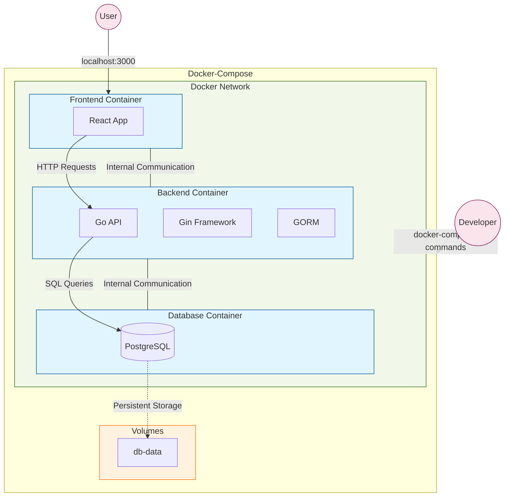
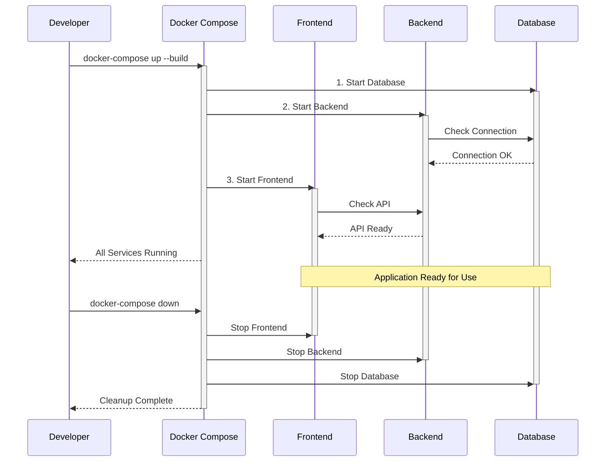

# Docker Compose: Part 2 - Interactive Script for GDG HKUST

## Script Overview

### Application Architecture


### Workflow Steps


### Summary
This tutorial shows how to use Docker Compose to run a multi-container todo app (React frontend, Go backend, PostgreSQL DB). We'll go from project setup to running the app with Docker Compose.

### Duration
- **Total Time**: 8-10 minutes
- **Setup Time**: 15-20 minutes (pre-recording)
- **Scene Breakdown**:
  - Introduction: 30 seconds
  - Project Structure: 1 minute
  - Docker Compose File: 2 minutes
  - Starting the App: 1 minute
  - Exploring the App: 2 minutes
  - Stopping the App: 1 minute
  - Compose File Details (Optional): 1.5 minutes
  - Production Tips: 30 seconds

### Key Focus Areas
1. **Multi-Container Apps**
   - How services connect
   - Container communication
   - Saving data

2. **Docker Compose Basics**
   - YAML setup
   - Defining services
   - Networks & volumes

3. **Development Workflow**
   - Running locally
   - Debugging tips
   - Useful commands

4. **Best Practices**
   - Production setup ideas
   - Security notes
   - Managing resources

### Learning Objectives
By the end, viewers will know:
- How to define multi-container apps with Docker Compose
- How services interact in containers
- Key Docker Compose commands
- Basic container orchestration best practices

## Pre-Recording Setup Instructions

[*VISUAL: Start with GDG HKUST logo animation fading into setup checklist*]

### Technical Setup
1. **Install Docker & Compose**: Make sure Docker and Docker Compose are installed and running.
2. **Terminal Ready**: Use a clean terminal, maybe with larger font size.
3. **Browser Ready**: Have a web browser open.
4. **Editor Ready**: Have your code editor open with the project files.
5. **GDG Branding**: Keep GDG HKUST logo/overlays handy.
6. **Test Commands**: Try all commands beforehand.
7. **Test App**: Run `docker-compose up` once before recording to check.

### Recording Environment
1. **Clean Desktop**: No personal files or distracting notifications.
2. **Privacy Check**: Close sensitive apps/info.
3. **Screen Resolution**: 1920x1080 recommended.
4. **Audio Check**: Test your microphone.
5. **Do Not Disturb**: Turn on DND mode.
6. **Quick Rehearsal**: Run through the steps once.


## Interactive Script for Docker Compose

### [SCENE 1: Introduction] - 30 seconds
[*VISUAL: Smooth fade from GDG logo to split screen setup*]
[*TRANSITION: Use slide-in animation for terminal and editor windows*]
[*VISUAL: GDG HKUST logo should pulse briefly when mentioned*]

**YOU:** "Hey there! 👋 Welcome back to our **Docker** and **Kubernetes** series! [*gesture: open arms welcome*] In Part 1, we containerized a simple web server. Today, we're *leveling up*! 🚀 We'll use **Docker Compose** to orchestrate *multiple containers* working together as a single application. Let's build a complete **todo app** with *frontend*, *backend*, and *database* containers!" [*gesture: hands showing multiple components coming together*]

---

### [SCENE 2: Understanding the Project Structure] - 1 minute
[***TRANSITION**: Smooth zoom into editor window showing project folders*]
[*VISUAL: Highlight frontend, backend folders*]

**YOU:** "Let's quickly look at our app structure. 🔍 We have three parts:" [*gesture: counting with fingers*]

**YOU:** "
1. A **React frontend** for the user interface.
2. A **Go backend** API to handle logic.
3. A **PostgreSQL database** to store data.

Real apps often have multiple parts like this. Docker Compose makes managing them easier." [*gesture: hands spreading out to show distribution*]

**YOU:** "Manually handling these could be tricky. Let's see how Docker Compose helps! 💡" [*gesture: wiping forehead showing relief*]

---
### [SCENE 3: The Docker Compose File] - 2 minutes
[***TRANSITION**: Focus on editor showing docker-compose.yml*]
[*VISUAL**: Highlight sections as they are discussed*]

**YOU:** "This is the **docker-compose.yml** file – the control center for our app. 🌟 It tells Docker how to run everything together." [*gesture: presenting with both hands*]

**YOU:** "Inside, we define **services**. Think of each service as a container. We have three: `frontend`, `backend`, and `db`." [*gesture: point to each service name*]

**YOU:** "For each service, we tell Compose:
- **How to build it**: Often using a Dockerfile in its folder (`build: ./frontend`).
- **What ports to open**: Connecting container ports to our machine (`ports: - '3000:3000'`).
- **Dependencies**: Which services need to start first (`depends_on: - backend`). This helps ensure things start in the right order." [*gesture: showing dependency link*]

*[Highlight backend environment variables]*

**YOU:** "We also set **environment variables**, like database connection details for the backend. Compose lets services talk to each other using their names (like `db`) – super handy! 🪄" [*gesture: magic wand motion*]

*[Highlight db volume]*

**YOU:** "For the database, we use the official PostgreSQL image and a **volume** (`db-data`). Volumes save our data even if the container stops or is removed. Crucial for databases! 💾" [*gesture: safe box motion*]

*[Highlight networks/volumes at bottom]*

**YOU:** "Compose also sets up a **network** so containers can communicate easily and manages our **volumes**. All defined right here! 👌" [*gesture: chef's kiss*]

---

### [SCENE 4: Starting the Application] - 1 minute
[***TRANSITION**: Slide terminal window in*]
[*VISUAL**: Clear terminal prompt*]

**YOU:** "Now, let's start everything with just **one command**!" [*gesture: pointing finger up*]

[***VISUAL**: Command typing animation*]

*[Run the command]*
```
docker-compose up --build
```

*[As it builds and starts, explain what's happening]*

**YOU:** "The `--build` flag ensures our images are rebuilt if anything changed. Watch how Docker Compose handles everything in the correct order - first the database, then the backend that depends on it, and finally the frontend! 🔄" [*gesture: stacking motion*]

<!-- *[Show logs scrolling]*
**YOU:** "Docker Compose aggregates all the logs in one place, color-coded by service. Looking at these logs, we can see the entire build process: first the backend image being built from the Golang base image, then the frontend from Node Alpine. Notice how it shows each step - downloading layers, copying files, running commands like 'go build' and 'pnpm install'. At the end, it creates our network, volume, and all three containers. This centralized logging is incredibly useful for debugging multi-container applications!" [*gesture: monitoring motion with hand sweeping across different sections of logs*] -->

---

### [SCENE 5: Exploring the Running Application] - 2 minutes
[*TRANSITION: Pan to a new terminal window, keep logs slightly visible if possible*]

**YOU:** "Okay, our app is running! Let's see what Compose did." [*gesture: investigative look*]

*[Run command]*
```
docker-compose ps
```

**YOU:** "This lists our running services: frontend, backend, and db. All running! 🟢" [*gesture: thumbs up*]

[*TRANSITION: Smooth slide to browser window*]
[*VISUAL: Go to http://localhost:3000*]

**YOU:** "Let's check the app in the browser!" [*gesture: presenting the app*]

*[Interact with the Todo app: Add a task, mark complete]*

**YOU:** "Whoray! It works! 🎉 When we add a todo, the React frontend talks to the Go backend API, which saves it in the PostgreSQL database container." [*gesture: trace flow with finger*]

*[Switch back to terminal]*

**YOU:** "Need to debug? We can easily check logs for one service:"

*[Run command]*
```
docker-compose logs backend
```

**YOU:** "Or run commands inside a container, like checking the database directly:" [*gesture: diving in motion*]

*[Run command]*
```
docker-compose exec db psql -U postgres -c "SELECT * FROM todos;"
```

**YOU:** "See? There's our data! Compose makes it easy to interact with individual parts. 📊" [*gesture: connected hands*]

---

### [SCENE 6: Stopping and Cleaning Up] - 1 minute
[*TRANSITION: Focus on terminal*]

**YOU:** "Done with the app? Stopping is just as easy." [*gesture: closing motion*]

*[Run command]*
```
docker-compose down
```

**YOU:** "The `down` command stops and removes the containers and network. Quick and clean! To remove the data volume too, you'd add `-v`. 🧹" [*gesture: dusting hands*]

*[Show containers stopping]*

---

### [OPTIONAL: SCENE 7: Compose File Details] - 1.5 minutes
[*TRANSITION: Focus back on docker-compose.yml*]

**YOU:** "Quickly, let's revisit some key concepts in the file:" [*gesture: quick review motion*]

*[Highlight networking]*
**YOU:** "**Networks**: Compose creates a private network so containers can talk using service names (like `backend` or `db`)."

*[Highlight environment variables]*
**YOU:** "**Environment Variables**: Great for configuration. For secrets like passwords, use `.env` files or Docker secrets in production."

*[Highlight volumes]*
**YOU:** "**Volumes**: Essential for saving data (like in our `db-data` volume). Without them, database data disappears when the container stops."

*[Highlight depends_on]*
**YOU:** "**Depends On**: Controls startup order. Remember, this waits for the *container* to start, not necessarily the *application inside* it. Production often needs health checks."

---

### [SCENE 8: Production Tips] - 30 seconds
[*TRANSITION: Professional slide with key points*]

**YOU:** "Quick tips if using Compose beyond local development:" [*gesture: quick tips gesture*]

**YOU:** "
- Use separate `docker-compose.prod.yml` files.
- Manage sensitive data securely (env files, secrets).
- Add health checks for reliable startup.
- For large scale, consider **Kubernetes** (our next topic!)." [*gesture: pointing forward*]

---

### [SCENE 9: Conclusion] - 30 seconds
[*TRANSITION: Camera view with GDG branding*]

**YOU:** "And that's Docker Compose! 🏆 We ran a **multi-container app** with one command, defining everything in a single file. Super useful for development!"

[*VISUAL: Success animation*]

**YOU:** "Next time, we'll deploy this same application to **Kubernetes**! 🚢 Stay tuned!" [*gesture: forward pointing motion*]

**YOU:** "If this helped, please like and subscribe to GDG HKUST! Thanks for watching! 👋" [*gesture: wave goodbye*]

## Motion Instructions and Timing

- **Total Video Length**: Aim for 8-10 minutes (comprehensive yet concise)
- **Pace**: Energetic but clear, maintain GDG professional enthusiasm
- **Motion Flow**: 
  - Use smooth GDG-branded transitions between scenes
  - Highlight code with animated overlays
  - Display command results with visual emphasis
  - Use split-screen to show relationship between services
  - Use animated diagrams to show data flow between containers
  
- **Visual Aids**:
  - GDG HKUST logo in corner throughout
  - Container relationship diagram showing frontend → backend → database flow
  - Command cheatsheet overlay during terminal sections
  - Animation showing how docker-compose builds the stack
  - Success/completion animations at key milestones

- **Engagement Tips**:
  - Maintain high energy appropriate for GDG presentations
  - Use emojis on screen to reinforce emotional points
  - Ask rhetorical questions to keep viewers thinking
  - Show genuine excitement when the application runs
  - Reference the GDG community and Docker Compose's importance in modern development 

## Visual Transition Guidelines

1. **Between Files**:
   - Use smooth sliding transitions
   - Maintain 0.5s transition duration
   - Add subtle blur effect during transition
   - Keep file hierarchy visible in sidebar

2. **Code to Terminal**:
   - Split screen with sliding animation
   - Highlight relevant code before switching
   - Use terminal fade-in effect
   - Keep code visible with reduced opacity

3. **Terminal to Docker**:
   - Use container visualization animations
   - Show service connections with animated lines
   - Highlight active container with pulse effect
   - Display logs with typing animation

4. **Browser Integration**:
   - Smooth slide from terminal to browser
   - URL bar typing animation
   - Page load progress animation
   - Split screen for showing backend responses

5. **Timing Guidelines**:
   - File transitions: 0.5s
   - Terminal fades: 0.3s
   - Code highlighting: 0.2s per section
   - Container animations: 0.7s
   - Browser transitions: 0.6s

## Emphasis Guidelines

1. **Technical Terms** (use bold + higher pitch):
   - Docker Compose
   - Containers
   - Services
   - Networks
   - Volumes

2. **Key Concepts** (use italic + visual highlight):
   - Multi-container
   - Orchestration
   - Dependencies
   - Configuration
   - Persistence

3. **GDG Elements** (use brand colors + enthusiasm):
   - GDG HKUST
   - Community
   - Tutorial series
   - Next steps

4. **Commands** (use code highlighting + typing animation):
   - docker-compose up
   - docker-compose down
   - docker-compose ps
   - docker-compose logs

5. **Success Moments** (use celebration animation + upbeat tone):
   - Application running
   - Services connected
   - Tasks completed
   - Features demonstrated 