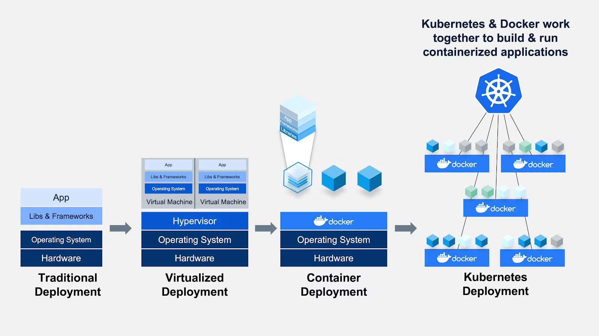
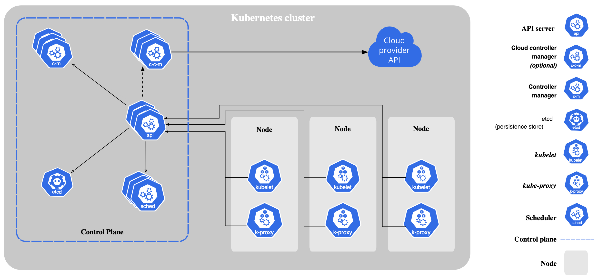

# Part 3: Deploying Multiple Applications using Kubernetes

In this part, we'll learn how to deploy our containerized application to Kubernetes. We'll use [Minikube](https://github.com/kubernetes/minikube) as our local Kubernetes cluster. Feel free to explore alternatives like [Kind](https://github.com/kubernetes-sigs/kind).

## Introduction to Kubernetes





## Installing Minikube

While Kubernetes can be run on various platforms, for this tutorial, we will use `Minikube`. Minikube is a lightweight Kubernetes implementation that creates a VM or container on your local machine and runs a single-node Kubernetes cluster inside it. Follow the [Getting Started Guide](https://minikube.sigs.k8s.io/docs/start/) to set up Minikube for your operating system.

You'll also need `kubectl` for interacting with the Kubernetes cluster. Install it by following the [official instructions](https://kubernetes.io/docs/tasks/tools/install-kubectl/).

## Starting Minikube

To start Minikube, run the following command:

```bash
minikube start
```

The first time you run this command, Minikube will download the necessary images and set up your Kubernetes environment. This may take several minutes depending on your internet connection. You'll see output similar to:

```bash
😄  minikube v1.35.0 on Darwin 15.3.2 (arm64)
✨  Automatically selected the docker driver
📌  Using Docker Desktop driver with root privileges
👍  Starting "minikube" primary control-plane node in "minikube" cluster
🚜  Pulling base image v0.0.46 ...
💾  Downloading Kubernetes v1.32.0 preload ...
```

## Building Images for Minikube

To build the Docker images for Minikube, we need to set the Docker environment to use Minikube's Docker daemon. This allows us to build images directly into Minikube's Docker environment, avoiding the need to push them to a remote registry.

```bash
# Step 1: Point to Minikube's Docker
eval $(minikube docker-env)

# Step 2: Build the images
docker build -t docker-k8s-todo-frontend:latest ../part2/frontend
docker build -t docker-k8s-todo-backend:latest ../part2/backend
```

To verify that the images are built correctly, you can run the following command and check if the two images are listed:

```bash
minikube image ls | grep docker-k8s-todo
```

You should see 2 images listed (frontend and backend).

> There are other methods for pushing images into Minikube. See the [Minikube Handbook](https://minikube.sigs.k8s.io/docs/handbook/pushing/) for more details.

## Deploying the Application

For simpler applications, we can use a single YAML file to define all the Kubernetes resources. In this case, we have separated the resources into three files: `frontend.yml`, `backend.yml`, and `database.yml`. To deploy all of these resources, use the `kubectl apply` command with the `-f` flag to specify the directory containing the YAML files.

```bash
kubectl apply -f . # when there are only yml files (want to deploy) in the directory
kubectl apply -f backend.yml -f frontend.yml -f database.yml
```

> To understand how Kubernetes specifications are defined, refer to [Kubernetes Concepts](https://kubernetes.io/docs/concepts/) and [KubeSpec](https://kubespec.dev/).

## Checking the Resources

To check the status of the deployed resources, you can use the following commands:

```bash
kubectl get deployments
kubectl get pods
kubectl get services
kubectl get pvc
```

> You can also start the Minikube dashboard by running `minikube dashboard`. This provides a user-friendly interface to view the status of all resources.

## Accessing the Application

You may have noticed that there is currently no way to access the application due to the internal network of Kubernetes. To access the application, we need to expose the frontend and backend. In this case, we are using a `LoadBalancer` service type and need to run the Minikube tunnel to acess the services:

```bash
minikube tunnel
```

> Explore [other ways](https://minikube.sigs.k8s.io/docs/handbook/accessing/) to access your applications, such as using NodePort or Ingress.


## Checking Logs

To check the logs of your running pods, you can use the `kubectl logs` command. This is useful for debugging and monitoring your application.

```bash
kubectl logs <pod-name>
```

## Cleanup

To clean up the resources:

```bash
kubectl delete -f .
```

To stop Minikube:

```bash
minikube stop
```

## Credit

This part of tutorial is based on the [Kubernetes Tutorial](https://kubernetes.io/docs/tutorials/kubernetes-basics/) and [Minikube Handbook](https://minikube.sigs.k8s.io/docs/handbook/).
