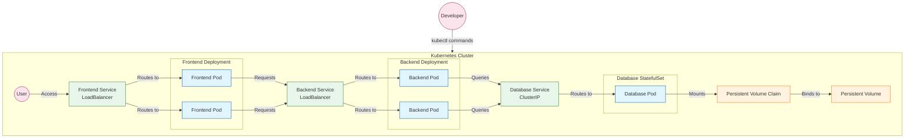
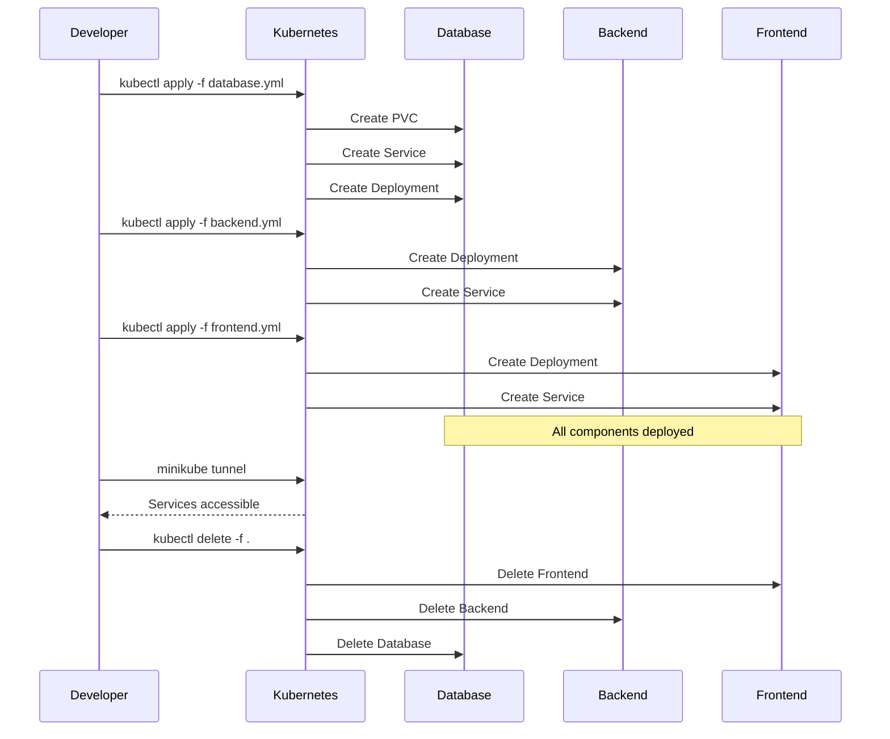

# Kubernetes: Part 3 - Interactive Script for GDG HKUST

## Script Overview

### Application Architecture


### Deployment Process


### Summary
This tutorial demonstrates how to deploy our multi-container Todo application on Kubernetes, moving from Docker Compose to container orchestration. We'll cover setting up a local Kubernetes cluster with Minikube, building Docker images for Kubernetes, defining deployments, services, and persistent volumes, and accessing the application through Kubernetes networking. The tutorial emphasizes practical, hands-on experience with Kubernetes concepts while highlighting the advantages over Docker Compose for production-ready deployments.

### Duration
- **Total Time**: 10-12 minutes
- **Setup Time**: 20-25 minutes (pre-recording)
- **Scene Breakdown**:
  - Introduction: 30 seconds
  - Kubernetes Overview: 1 minute
  - Minikube Setup: 1 minute
  - Building Images: 2 minutes
  - Kubernetes Manifests: 2-3 minutes
  - Deploying the Application: 1-2 minutes
  - Accessing & Testing: 1-2 minutes
  - Scaling & Updates: 1 minute
  - Cleanup: 30 seconds
  - Conclusion: 30 seconds

### Key Focus Areas
1. **Kubernetes Fundamentals**
   - Pods, Deployments, Services
   - Persistent Volumes
   - Declarative configuration with YAML
   - Container orchestration benefits

2. **Local Development with Minikube**
   - Cluster setup and management
   - Image building strategies
   - Deployment workflow
   - Troubleshooting techniques

3. **Application Architecture**
   - Microservices communication in Kubernetes
   - Service discovery and DNS
   - Kubernetes networking model
   - Stateful vs. Stateless components

4. **Operational Advantages**
   - Dynamic scaling capabilities
   - Zero-downtime deployments
   - Resource management and optimization
   - Simplified cleanup procedures

### Learning Objectives
By the end of this tutorial, viewers will understand:
- The fundamental differences between Docker Compose and Kubernetes
- How to set up and manage a local Kubernetes development environment
- How to define, deploy and connect microservices in Kubernetes
- How to implement persistent storage for stateful applications
- How to scale applications dynamically with zero downtime
- How to access services running in Kubernetes from outside the cluster

## Pre-Recording Setup Instructions

[*VISUAL: Start with GDG HKUST logo animation fading into setup checklist*]

### Technical Setup
1. **Minikube & kubectl** - Ensure Minikube and kubectl are properly installed
2. **Docker** - Docker must be running for Minikube with Docker driver
3. **Terminal Setup** - Use a clean terminal with increased font size (16-20pt) for better visibility
4. **Browser** - Have a web browser ready for viewing the application
5. **Text Editor/IDE** - Have VS Code or your preferred editor ready with the project files open
6. **GDG Branding** - Have GDG HKUST logo and branding elements ready for overlays
7. **Demo Checkpoints** - Test all commands beforehand to ensure smooth demonstration
8. **Verify Resources** - Ensure enough system resources for running Minikube without lag

### Recording Environment
1. **Clean Desktop** - Remove personal files, notifications, and set a neutral background
2. **Privacy Check** - Close any sensitive information, emails, or personal apps
3. **Screen Resolution** - Set to 1920x1080 for optimal viewing
4. **Microphone Test** - Check audio quality before starting
5. **Do Not Disturb** - Enable Do Not Disturb mode to avoid notifications
6. **Rehearse Once** - Run through the commands once before recording to ensure everything works

## Interactive Script for Kubernetes

### [SCENE 1: Introduction] - 30 seconds
[*VISUAL: Smooth fade from GDG logo to split screen setup*]
[*TRANSITION: Use slide-in animation for terminal and editor windows*]
[*VISUAL: GDG HKUST logo should pulse briefly when mentioned*]

[PRESENTER NOTE: Start with high energy and enthusiasm to set the tone]

**YOU:** "Welcome back to our **GDG HKUST** Docker and Kubernetes series! 👋 In our previous tutorial, we orchestrated a multi-container application using Docker Compose. Today, we're scaling up to **Kubernetes**! 🚀 We'll take our **Todo app** and deploy it to a **Kubernetes cluster** using **Minikube**. This is where real container orchestration begins!" [*gesture: expansive motion showing growth*]

---

### [SCENE 2: Kubernetes Overview] - 1 minute
[*TRANSITION: Slide to clean screen with Kubernetes architecture diagram*]
[*VISUAL: Animated Kubernetes components appearing as mentioned*]

**YOU:** "Before diving in, let's understand what **Kubernetes** brings to the table compared to Docker Compose." [*gesture: comparison motion*]

**YOU:** "**Kubernetes** is a powerful container orchestration platform that manages containerized applications across multiple machines. As shown in this diagram, we can see the evolution from traditional deployment to Kubernetes deployment. While Docker Compose helps us run multiple containers on a single host, Kubernetes extends this capability across an entire cluster of machines."

**YOU:** "Where Docker Compose is perfect for local development, **Kubernetes** powers production environments at any scale." [*gesture: small to large scaling motion*]

**YOU:** "Key **Kubernetes** concepts include:" [*gesture: counting with fingers*]

[*VISUAL: **SLIDES**: Each component appears with animation*]

https://www.youtube.com/watch?v=TlHvYWVUZyc

Here is a video that explains the concepts of kubernetes in 6 mins, it is from one of my favorite youtube channel, **ByteByteGo**, a channel about system design and system architecture. Please watch the video and come back.

Lets recap the concepts of kubernetes:
1. **Pods** - Smallest deployable units containing containers that share resources. Our Todo app components will run in separate pods.

2. **Deployments** - Manage pods and maintain desired replica count, automatically replacing failed pods.

3. **Services** - Network abstractions providing stable endpoints for pods, enabling communication between components.

4. **Persistent Volumes** - Storage resources independent of pods, ensuring data persistence across pod lifecycles.

5. **ConfigMaps and Secrets** - Store configuration separately from code, like database connection details.

We only briefly introduced these concepts about kubernetes, if you are interested in learning more, you can visit kubernetes.io, now we'll dive deeper into the implementation.

Let's see these concepts in action with our Todo application!" [*gesture: transition motion*]

[ENGAGEMENT QUESTION: "If you're familiar with Docker Compose, what do you think would be the biggest difference in how we manage our application?"]

---

### [SCENE 3: Minikube Setup] - 1 minute
[*TRANSITION: Smooth pan to terminal window*]
[*VISUAL: Command prompt with GDG styling*]

[PRESENTER NOTE: Explain Minikube as the "training restaurant" before the real production setup]

**YOU:** "For local development, we'll use **Minikube** - a lightweight **Kubernetes** implementation that runs on your laptop. Think of it as your practice restaurant before opening the real thing. Let's start our cluster:" [*gesture: starting motion*]

*[Run command]*
```
minikube start
```

**YOU:** "**Minikube** creates a virtual machine or container that runs a single-node **Kubernetes** cluster. The first run might take a few minutes as it downloads necessary components." [*gesture: patient waiting*]

[TROUBLESHOOTING TIP: "If you encounter any issues with Minikube startup, make sure Docker is running and you have enough resources allocated to Docker."]

**YOU:** "Let's verify our cluster is ready:" [*gesture: checking motion*]

*[Run command]*
```
kubectl get nodes
```

**YOU:** "Great! We have a running **Kubernetes** node. This single node will host all the components of our application, but in a production environment, you'd typically have multiple nodes across different machines."

[KNOWLEDGE CHECK: "Our minikube cluster is now ready - this gives us a complete Kubernetes environment for development."]

---

### [SCENE 4: Building Images for Kubernetes] - 2 minutes
[*TRANSITION: Split screen with terminal and editor*]
[*VISUAL: Editor showing Dockerfile and terminal side by side*]

[PRESENTER NOTE: Emphasize the difference in image building compared to Docker Compose]

**YOU:** "When using **Minikube**, there's an important difference in how we build images. We need to build directly in **Minikube's** Docker environment, not our local Docker as we did with Docker Compose. This ensures the images are available inside our Kubernetes cluster." [*gesture: pointing to different environments*]

**YOU:** "First, let's point our Docker client to **Minikube's** Docker daemon - think of this as connecting to the kitchen in our practice restaurant:" [*gesture: connecting motion*]

*[Run command]*

```
eval $(minikube docker-env)
```

**YOU:** "Now our Docker commands will build images inside **Minikube** instead of locally. Let's build our frontend and backend images:" [*gesture: building motion*]

*[Run command]*

```
docker build -t docker-k8s-todo-frontend:latest ../part2/frontend
docker build -t docker-k8s-todo-backend:latest ../part2/backend
```

[EXPLANATION: "We're using the same Dockerfiles from Part 2, but building them in Minikube's environment. The 'latest' tag tells Kubernetes to use the most recent version."]

**YOU:** "Let's verify our images are available in **Minikube**:" [*gesture: checking motion*]

*[Run command]*
```
minikube image ls | grep docker-k8s-todo
```

**YOU:** "Perfect! Our images are ready for deployment. Now let's look at the **Kubernetes manifests** that will define our deployment. This is where Kubernetes really shines compared to Docker Compose." [*gesture: moving to next step*]

---

### [SCENE 5: Kubernetes Manifests] - 2 minutes
[*TRANSITION: Slide editor window to center*]
[*VISUAL: Open YAML files with syntax highlighting*]

[PRESENTER NOTE: Break down the YAML files into understandable chunks, using the restaurant analogy]

**YOU:** "Unlike Docker Compose's single file, in **Kubernetes** we define our infrastructure using multiple YAML manifests with specific **resource types** and **API versions**. Think of these as detailed recipes and instructions for different parts of our restaurant." [*gesture: presenting files*]

*[Open and highlight `frontend.yml`]*

**YOU:** "Let's focus on key Kubernetes concepts you won't find in Docker Compose:" [*gesture: pointing*]

```yaml
# 1. API Versioning
apiVersion: apps/v1
kind: Deployment

# 2. Label-selector system for service discovery
selector:
  matchLabels:
    app: frontend  # Which pods belong to this deployment?
    
# 3. Image pull policies
imagePullPolicy: Never  # When to fetch images from registry
```

**YOU:** "The **API versioning** is how Kubernetes manages changes to its API over time - like recipe book editions. The **label-selector mechanism** is how different parts find each other - like color-coded tickets in a restaurant that connect orders to tables. This creates a loose coupling between services and pods, enabling powerful features like rolling updates and scaling." [*gesture: flexibility motion*]

*[Open and highlight `database.yml`]*

**YOU:** "The database manifest shows how powerful Kubernetes can be. First, notice how a single file defines multiple resources separated by `---` - like different sections of a recipe:" [*gesture: separation motion*]

```yaml
# First resource: Deployment
apiVersion: apps/v1
kind: Deployment
metadata:
  name: db
# ...configuration...
---
# Second resource: Service
apiVersion: v1
kind: Service
metadata:
  name: db-service
# ...configuration...
---
# Third resource: PersistentVolumeClaim
apiVersion: v1
kind: PersistentVolumeClaim
metadata:
  name: db-pvc
```

[EXPLANATION: "Each section creates a different Kubernetes resource, but they're all related to our database component. This keeps related resources together in one file."]

**YOU:** "For stateful applications like databases, Kubernetes has specific best practices to ensure data consistency and security:" [*gesture: pointing at key settings*]

```yaml
# Single replica to avoid data conflicts in stateful applications
replicas: 1 # Only one replica for database to avoid data conflicts

# Environment variables (in production, use Secrets instead)
env:
  - name: POSTGRES_PASSWORD
    value: "postgres" # In production, use Kubernetes Secrets
    
# Internal-only access for security
type: ClusterIP # Only accessible within the cluster for security
```

**YOU:** "For persistent storage - one of the most important aspects of databases - Kubernetes uses a sophisticated three-tier system, much more advanced than Docker Compose volumes:" [*gesture: three-tier motion*]

```yaml
# 1. PersistentVolumeClaim - requests storage
apiVersion: v1
kind: PersistentVolumeClaim
metadata:
  name: db-pvc # Name referenced by the volume in the deployment
spec:
  accessModes:
    - ReadWriteOnce # Can be mounted as read-write by a single node
  resources:
    requests:
      storage: 1Gi # Requesting 1 gigabyte of persistent storage

# 2. Volume definition - references the claim
volumes:
  - name: db-data # Volume definition
    persistentVolumeClaim:
      claimName: db-pvc # Reference to the PVC defined above

# 3. Volume mount - container access point
volumeMounts:
  - name: db-data # Mount point for persistent storage
    mountPath: /var/lib/postgresql/data # PostgreSQL data directory
```

[ANALOGY: "Think of this as: (1) The PVC is like reserving storage space in our pantry, (2) The volume definition is like labeling a shelf with the reservation name, and (3) The volume mount is like telling the chef which shelf to use."]

**YOU:** "This separation creates a **storage lifecycle** independent from pods. The PVC requests storage, the pod references the claim, and containers mount the volume - much more sophisticated than Docker Compose volumes." [*gesture: lifecycle motion*]

**YOU:** "The service discovery mechanism is also worth noting - this is how pods find each other:" [*gesture: connection motion*]

```yaml
# In Service definition
metadata:
  name: db-service # Name that other services will use to connect
spec:
  selector:
    app: db # Routes traffic to pods with label app=db
```

**YOU:** "Backend pods can now connect to the database using `db-service` as the hostname in their environment variables - Kubernetes handles all service discovery automatically. It's like having a receptionist who always knows where to direct calls, even if employees change desks." [*gesture: networking motion*]

[KNOWLEDGE CHECK: "So far we've seen how Kubernetes separates concerns into different resource types and uses labels to connect them. This makes the system much more flexible than Docker Compose."]

**YOU:** "For a deeper understanding of these resources, the Kubernetes documentation at kubernetes.io offers excellent guides on each concept. I highly recommend exploring it when you're ready to learn more." [*gesture: recommendation motion*]

---

### [SCENE 6: Deploying the Application] - 1-2 minutes
[*TRANSITION: Pan to terminal window*]
[*VISUAL: Clean terminal with command prompt*]

[PRESENTER NOTE: Connect this step to previous explanation to show how the manifests become running components]

**YOU:** "Now for the exciting part - let's deploy our application to **Kubernetes**! We'll apply our manifest files, and Kubernetes will create all the resources we've defined:" [*gesture: deploy motion*]

*[Run command]*
```
kubectl apply -f database.yml -f backend.yml -f frontend.yml
```

**YOU:** "With this one command, **Kubernetes** processes our manifests and creates all the required resources - deployments, services, and persistent volumes. Let's check the status of our deployments:" [*gesture: status check*]

*[Run command]*
```
kubectl get deployments
```

[EXPLANATION: "This command shows us all deployments in our default namespace. We should see frontend, backend, and db deployments all showing as ready."]

**YOU:** "Now let's check our pods to see if they're running - these are the actual containers executing our application code:" [*gesture: detailed check*]

*[Run command]*
```
kubectl get pods
```

**YOU:** "We can see more details about a specific pod using the describe command. This is extremely useful for troubleshooting:" [*gesture: zoom in motion*]

*[Run command]*
```
kubectl describe pod $(kubectl get pods -l app=frontend -o name | head -n 1)
```

[TIP: "The describe command is your best friend when debugging Kubernetes issues. It shows events, conditions, and configuration details."]

**YOU:** "Let's also verify our services are created - these will route traffic to our pods:" [*gesture: network check*]

*[Run command]*
```
kubectl get services
```

**YOU:** "Great! Our application is fully deployed to **Kubernetes**! All three components are running and connected through services." [*gesture: success motion*]

---

### [SCENE 7: Accessing & Testing the Application] - 1-2 minutes
[*TRANSITION: Split screen with terminal and browser*]
[*VISUAL: Terminal and browser side by side*]

[PRESENTER NOTE: Explain why accessing services in Kubernetes is different from Docker Compose]

**YOU:** "Now, to access our application running on **Minikube**, we need an extra step compared to Docker Compose. We need to create a tunnel for **LoadBalancer** services to make them accessible from our computer:" [*gesture: tunnel motion*]

*[Run command in a new terminal window]*
```
minikube tunnel
```

**YOU:** "This command creates a network route so our computer can reach the LoadBalancer services in Kubernetes. You may need to enter your password for network changes." [*gesture: permission granting*]

[EXPLANATION: "In a cloud environment, LoadBalancer services would get real external IP addresses automatically. Minikube simulates this behavior with tunneling."]

**YOU:** "Now let's check our service again to see the external IP that we can use to access our application:" [*gesture: looking for address*]

*[Run command]*
```
kubectl get services
```

**YOU:** "Great! Now we can access our frontend in the browser using this IP address:" [*gesture: presenting browser*]

[*TRANSITION: Elegant slide to browser window*]
[*VISUAL: URL bar typing animation for http://localhost:3000*]

*[Navigate to the frontend URL and interact with the Todo app]*

**YOU:** "Our Todo application is running on **Kubernetes**! 🎉 Let's add a few todos to test it out." [*gesture: interacting with app*]

**YOU:** "Behind the scenes, something amazing is happening: the frontend service routes traffic to frontend pods, which communicate with backend pods through the backend service, which in turn connect to the database pod via the database service. All these connections are managed automatically by Kubernetes!" [*gesture: flow from front to back*]

[KNOWLEDGE CHECK: "We've now seen how Kubernetes handles networking between components automatically using the Service resources we defined earlier."]

**YOU:** "Let's check that our todos are being stored correctly by looking at the backend logs:" [*gesture: investigating*]

*[Run command]*
```
kubectl logs deployment/backend
```

**YOU:** "Perfect! Everything is working just as we designed it!" [*gesture: thumbs up*]

---

### [SCENE 8: Scaling & Updates] - 1 minute
[*TRANSITION: Return to terminal*]
[*VISUAL: Terminal window with GDG theme*]

[PRESENTER NOTE: Highlight this as a key advantage over Docker Compose]

**YOU:** "Now let's explore two powerful **Kubernetes** capabilities that truly separate it from Docker Compose: **dynamic scaling** and **rolling updates**." [*gesture: expansion motion*]

**YOU:** "With a single command, we can scale our frontend to handle more traffic. Let's increase it to 3 replicas:" [*gesture: scaling motion*]

*[Run command]*
```
kubectl scale deployment frontend --replicas=3
```

*[Run command]*
```
kubectl get pods
```

**YOU:** "Look at that! Kubernetes instantly creates additional pods with automatic load balancing across all of them. This is true horizontal scaling with zero downtime - something that would require significant effort with Docker Compose." [*gesture: spreading motion*]

[ENGAGEMENT QUESTION: "Think about how you would implement this same scaling capability with Docker Compose. Consider all the manual steps that Kubernetes is automating for us."]

**YOU:** "If you're interested in learning more about Kubernetes' advanced capabilities, the official documentation at kubernetes.io provides excellent tutorials and concept guides." [*gesture: reference motion*]

---

### [SCENE 9: Cleanup] - 30 seconds
[*TRANSITION: Clean terminal view*]
[*VISUAL: Terminal with cleanup commands*]

[PRESENTER NOTE: Explain why cleanup is important for local development resources]

**YOU:** "When we're done experimenting, cleaning up is simple and important to free up local resources:" [*gesture: cleanup motion*]

*[Run command]*
```
kubectl delete -f frontend.yml -f backend.yml -f database.yml
```

**YOU:** "This removes all the resources we created - pods, services, deployments, and even the persistent volume claim. To stop our **Minikube** cluster:" [*gesture: shutdown motion*]

*[Run command]*
```
minikube stop
```

**YOU:** "And if you want to completely delete the cluster to free up more resources:" [*gesture: complete removal*]

*[Run command]*
```
minikube delete
```

[TIP: "You can always start a fresh cluster later with 'minikube start' if you want to experiment more."]

---

### [SCENE 10: Conclusion] - 30 seconds
[*TRANSITION: Camera view with GDG branding*]
[*VISUAL: Kubernetes logo with GDG HKUST elements*]

[PRESENTER NOTE: Brief, impactful summary]

**YOU:** "We've successfully deployed our Todo app to **Kubernetes**! 🏆 We've experienced container orchestration with deployments, service discovery, persistent storage, and scaling through simple declarative configurations." [*gesture: accomplished motion*]

**YOU:** "This is just the beginning. For more depth, visit kubernetes.io. As applications grow complex, Kubernetes provides the tools to manage that complexity." [*gesture: expanding possibilities*]

**YOU:** "Thanks for joining this **GDG HKUST** series on cloud-native development. Apply these concepts in your projects and check our other events! 👋" [*gesture: friendly wave*]

[FINAL KNOWLEDGE CHECK: "Today we moved from Docker Compose to Kubernetes, learning multi-container deployment with service discovery, persistent storage, and scaling."]

## Motion Instructions and Timing

- **Total Video Length**: Aim for 10-12 minutes
- **Pace**: Energetic but clear, maintain GDG professional enthusiasm
- **Motion Flow**: 
  - Use smooth GDG-branded transitions between scenes
  - Highlight YAML with animated overlays
  - Display kubectl commands with visual emphasis
  - Use split-screen to show relationship between components
  - Use animated diagrams to show Kubernetes architecture
  
- **Visual Aids**:
  - GDG HKUST logo in corner throughout
  - Kubernetes architecture diagram with pods, services, and volumes
  - Command cheatsheet overlay during kubectl sections
  - Animation showing how pods, services, and volumes interact
  - Success/completion animations at key milestones

- **Engagement Tips**:
  - Maintain high energy appropriate for GDG presentations
  - Use emojis on screen to reinforce emotional points
  - Compare Docker Compose vs. Kubernetes at key points
  - Show genuine excitement when the application runs
  - Reference the GDG community and Kubernetes' importance in modern cloud architecture

## Visual Transition Guidelines

1. **Between Files**:
   - Use smooth sliding transitions
   - Maintain 0.5s transition duration
   - Add subtle blur effect during transition
   - Keep file hierarchy visible in sidebar

2. **Code to Terminal**:
   - Split screen with sliding animation
   - Highlight relevant YAML before switching
   - Use terminal fade-in effect
   - Keep manifests visible with reduced opacity

3. **Terminal to Kubernetes**:
   - Use pod visualization animations
   - Show service connections with animated lines
   - Highlight active resources with pulse effect
   - Display logs with typing animation

4. **Browser Integration**:
   - Smooth slide from terminal to browser
   - URL bar typing animation
   - Page load progress animation
   - Split screen for showing backend pods and logs

5. **Timing Guidelines**:
   - File transitions: 0.5s
   - Terminal fades: 0.3s
   - YAML highlighting: 0.2s per section
   - Kubernetes animations: 0.7s
   - Browser transitions: 0.6s

## Emphasis Guidelines

1. **Technical Terms** (use bold + higher pitch):
   - Kubernetes
   - Minikube
   - Pods
   - Deployments
   - Services

2. **Key Concepts** (use italic + visual highlight):
   - Orchestration
   - Scaling
   - Self-healing
   - Rolling updates
   - Persistence

3. **GDG Elements** (use brand colors + enthusiasm):
   - GDG HKUST
   - Community
   - Tutorial series
   - Cloud native

4. **Commands** (use code highlighting + typing animation):
   - kubectl apply
   - kubectl get
   - kubectl describe
   - minikube start
   - kubectl scale

5. **Success Moments** (use celebration animation + upbeat tone):
   - Cluster running
   - Pods deployed
   - Application accessible
   - Scaling successful
   - Updates completed 