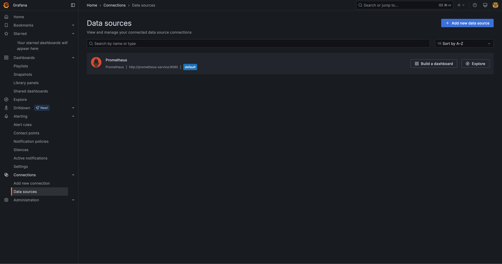

# Part 4: Observability using Prometheus and Grafana

In this part, we'll learn how to set up an observability workload for monitoring with Prometheus and Grafana.

## Overview

We will set up a monitoring stack using [Prometheus](https://github.com/prometheus/prometheus) and [Grafana](https://github.com/grafana/grafana) to visualize the health of a Postgres database. To keep it simple, we will not include the frontend and backend from the previous part.

The resources are defined in the following files:

- [grafana.yml](grafana.yml): Contains the Grafana Deployment, Service, and PVC (Persistent Volume Claim) for storing Grafana data. It is a powerful visualization tool that can be used to create dashboards and alerts based on the metrics collected by Prometheus or other data sources (e.g., Graphite, Snowflake, Datadog).
- [grafana-configmap.yml](grafana-configmap.yml): Contains the ConfigMap for Grafana, which helps provision preconfigured data sources (to Prometheus) and dashboards (embedded as JSON).
- [prometheus.yml](prometheus.yml): Contains the Prometheus Deployment, Service, and PVC. It is a TSDB (Time Series Database) that stores metrics in a time series format, allowing for efficient querying and analysis of time-based data.
- [postgres-exporter.yml](postgres-exporter.yml): Contains the Postgres Exporter Deployment and Service. It helps collect metrics from a PostgreSQL database and exposes them in a format that Prometheus can scrape.
- [postgres.yml](postgres.yml): Contains the sample Postgres database deployment and service, where its metrics would be collected by the Postgres Exporter.

## Running the Resources

Same as before, apply the resources using the `kubectl apply` command with the `-f` flag to specify the directory containing the YAML files.
   
```bash
kubectl apply -f .
```

To access the application, we need to expose Grafana and Prometheus. In this case, we are using a `LoadBalancer` service type and need to run the Minikube tunnel to access the services:

```bash
minikube tunnel
```

> If you would like to use a different namespace, you can add the `-n` flag to the `kubectl apply` command. For example, to use the `part4` namespace, you can run `kubectl apply -f . -n part4`, and the same applies to other `kubectl` commands.

## Accessing the Services

Once the tunnel is running, you can access the services at:

- Prometheus: http://localhost:9090
- Grafana: http://localhost:3000
  - Default username: admin
  - Default password: admin

## Exploring Grafana

If you navigate to Prometheus and go to the `Status > Targets` page, you should see it successfully scraping the metrics from the Postgres Exporter.


After logging in to Grafana, you should see the preconfigured dashboards on the `Dashboards` page and data sources on the `Data Sources` page. The dashboards are preconfigured to visualize the metrics collected by Prometheus, and the data sources are configured to connect Grafana to Prometheus.




## Helm Chart (Further Reading)

If you found the manual process of writing all these specifications tedious, you can actually make use of something that others have already done. The [Kube Prometheus Stack](https://artifacthub.io/packages/helm/prometheus-community/kube-prometheus-stack) is a collection of Kubernetes manifests, Grafana dashboards, and Prometheus rules that can be used to deploy a complete monitoring stack on Kubernetes.
