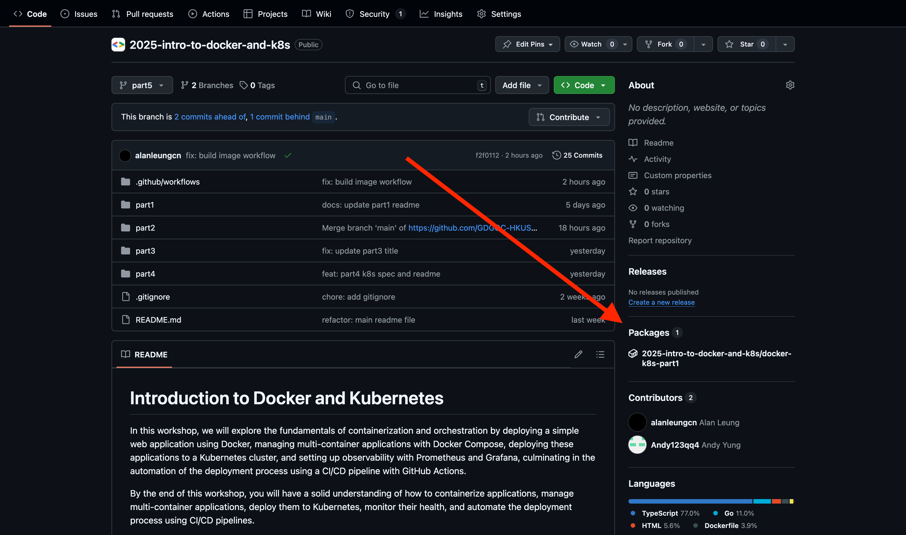
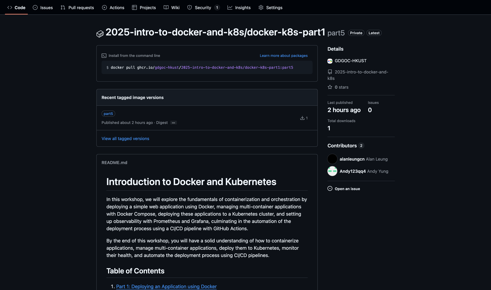

# Part 5: CI/CD Pipeline Integration using GitHub Actions

This part demonstrates how to integrate a CI/CD pipeline using GitHub Actions to automate building and pushing Docker images.

## What's GitHub Actions?

GitHub Actions is a CI/CD platform that allows you to automate your software workflows directly in your GitHub repository. It enables you to build, test, and deploy your code based on events like pushes, pull requests, or scheduled triggers.

## Tips for Local Development

You can use the [`act`](https://github.com/nektos/act) tool to test GitHub Actions workflows locally. For example, the following command simulates a push event and runs the workflow you have defined:

```bash
act push
```

## Writing the Workflow

To create a GitHub Actions workflow, define it in a YAML file inside the `.github/workflows` directory of your repository. Our [workflow](../.github/workflows/build_image.yml) builds and publishes the image for part 1 of this workshop. It involves the following steps:

1. **Checkout Repository**: Fetches the repository code using `actions/checkout`.
2. **Log in to Container Registry**: Authenticates with the GitHub Container Registry using `docker/login-action`.
3. **Extract Docker Metadata**: Generates tags and labels for the Docker image using `docker/metadata-action`.
4. **Build and Push Docker Image**: Builds the Docker image from the `part1` directory and pushes it to the registry using `docker/build-push-action`.

If the workflow runs successfully, you should find a new package under the "Packages" section on the repository's home page.



If you navigate to the package, you will see the image that was built and pushed. You can also find the image tags and labels generated during the workflow.



## Testing the Image

Run the following command to pull the image from the GitHub Container Registry and run it. You should see the same result as in part 1 of this workshop:

```bash
docker run -p 8080:8080 ghcr.io/gdgoc-hkust/2025-intro-to-docker-and-k8s/docker-k8s-part1:main
```

## Further Readings

Now you can try to fork this repository and create a GitHub Actions workflow to build and push other images (e.g., the frontend and backend of part 2). The following snippet might be helpful:

```yaml
jobs:
  build-and-push-image:
    # ...
    strategy:
      matrix:
        directory: [part1, part2/frontend, part2/backend]
    # ...
```

Feel free to explore ways to push the image to other registries like Docker Hub or AWS ECR. You can then deploy the image to a cloud Docker/Kubernetes runtime, such as AWS ECS/EKS, GCP Cloud Run/GKE, or Azure Container Apps/AKS.
